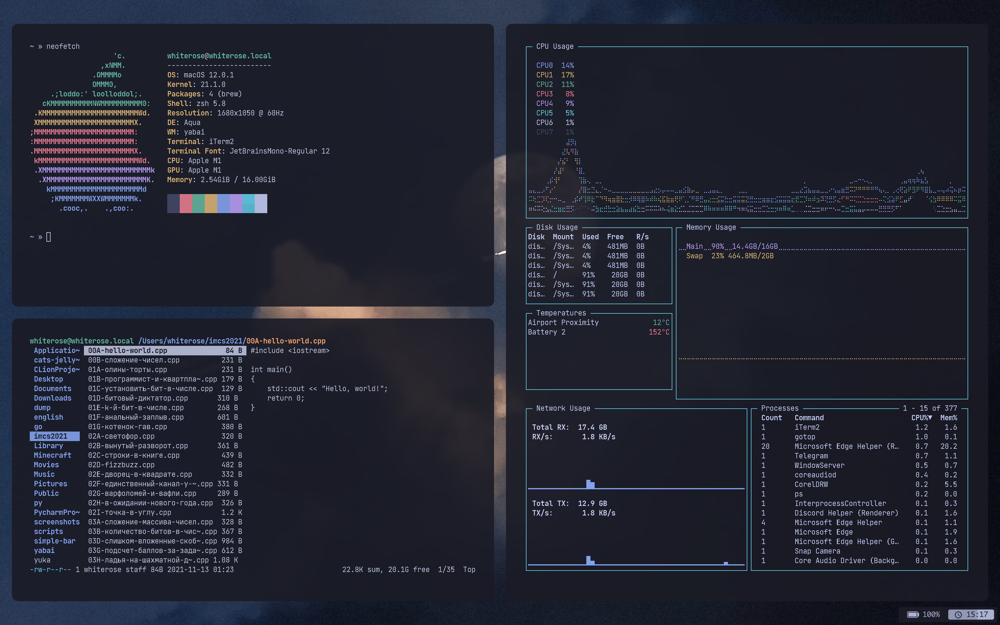

<h1 align="center">tokyonight dotfiles</h1>

  
  

# what i use

+ **os:** macos monterey 12.0.1  
+ **wm:** [yabai](https://github.com/koekeishiya/yabai)  
+ **bar:** [simple-bar](https://github.com/Jean-Tinland/simple-bar)  
+ **font:** [jetbrains mono](https://www.jetbrains.com/ru-ru/lp/mono/)  
+ **wallpaper:** [wallhaven](https://wallhaven.cc/w/x8d67o) 
+ **terminal:** [iterm2](https://github.com/gnachman/iTerm2)  
+ **terminal apps:** neofetch, gotop, ranger, vim  
